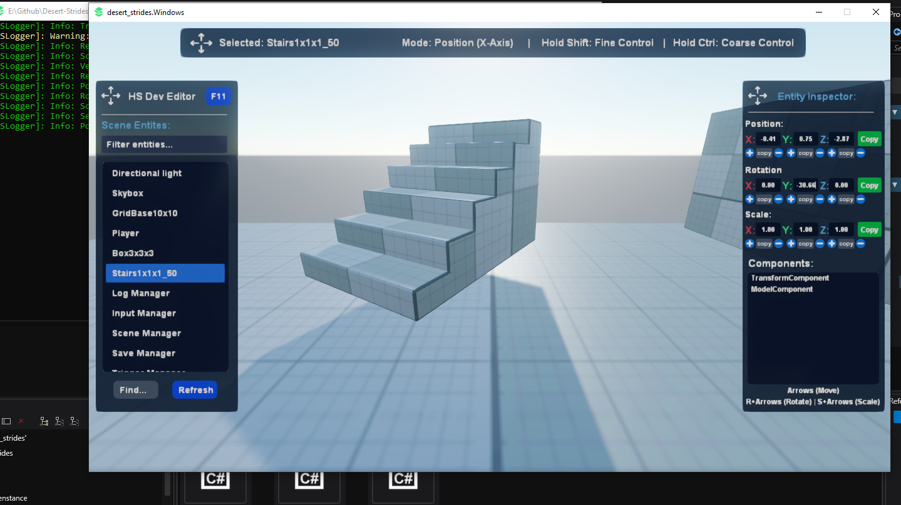

# HS Live Dev Editor for Stride

Live runtime editor for Stride Game Engine. Edit transforms, test changes, and manipulate entities during gameplay without stopping to switch back to Game Studio.

## 🎯 Overview

HS Dev Editor solves the time-consuming cycle of switching between Stride Studio and game testing. Instead of constantly stopping your game to make small adjustments in the editor, you can manipulate objects live, test immediately, and then transfer the final values back to your project.



### Design Philosophy

### Tool Ecosystem Workflow
1. **Dev Console:** Entity spawning, complex operations, custom commands (Not Included)
2. **Dev Camera:** Scene navigation, positioning, camera setup  
3. **Dev Editor:** Transform editing, fine-tuning, testing
4. **Scene Browser:** Entity management, selection, hierarchy
5. **Property Inspector:** Precise values, clipboard operations

**Optimal Workflow:** Build → Test Live → Refine → Copy Final Values → Apply in Studio

## 🚀 Installation

### Recommended: One-Click Installation
1. **Download [HS Stride Packer](https://github.com/Keepsie/HS-Stride-Packer)**
2. **Download** this library's `.stridepackage` file from [Releases](https://github.com/Keepsie/HS-Stride-Live-Dev-Editor/releases)
3. **Import** using HS Stride Packer - everything installs automatically!

### Alternative: Manual Installation
- Code is open source - you can still copy files manually if preferred
- See legacy installation instructions 
- HS Stride Packer handles all dependencies and setup automatically

### Prerequisites
- Stride Engine 4.2.0.2381 or newer
- HS Stride Packer (for easy installation)

### ⚠️ IMPORTANT: Input Integration

**To avoid conflicting inputs, integrate these bools into your input systems:**

```csharp
// Get references to the dev tools
var devEditorManager = Entity.Scene.FindAllComponents_HS<DevEditorManager>().FirstOrDefault();
var devCamera = Entity.Scene.FindAllComponents_HS<DevCamera>().FirstOrDefault();

// Check before processing your input
if (!devEditorManager?.DevEditorActive && !devCamera?.DevCameraActive)
{
    // Safe to process your game input
    HandlePlayerInput();
    HandleGameplayInput();
}

// Specific keys to avoid when dev tools are active:
// F10, F11 - Tool toggles
// Arrow Keys, R, S - When DevEditorActive is true
// Ctrl+Z, Ctrl+Y - When DevEditorActive is true
// WASD, Mouse, E, Q - When DevCameraActive is true
```

## 🎮 Usage Guide

### Basic Workflow

1. **Start Development Session**
   - Run your game with HS Dev Editor installed
   - Press `F11` to activate the editor interface
   - Press `F10` to enable free-fly camera (optional)

2. **Entity Selection**
   - Click entities in the Scene Browser, or
   - Use existing game selection methods
   - Selected entity is highlighted in the browser

3. **Live Manipulation**
   - Use arrow keys for quick adjustments
   - Use inspector input fields for precise values
   - Changes are applied immediately with visual feedback

4. **Value Transfer**
   - Use copy buttons to get final transform values
   - Paste into Stride Studio Editor
   - Apply changes to your project files

## Advanced Workflows

**Camera Positioning:**
```
1. Fly dev camera to desired position/angle
2. Select your game camera entity
3. Press Ctrl+Shift+F to align camera with view
4. Copy rotation values from inspector
5. Apply to your camera scripts or components
```

**Level Design Iteration:**
```
1. Build rough layout in Stride Studio
2. Test with HS Dev Editor
3. Adjust object positions with arrow keys
4. Copy final coordinates
5. Update original prefabs/scenes
```

## ⚙️ Configuration

### History System
```csharp
devEditorManager.ConfigureHistorySize(100); // Increase history size
devEditorManager.ClearHistory(); // Reset history
```

### Movement Sensitivity
Adjust step values in code:
- `POSITION_STEP = 0.1f` - Position increment
- `ROTATION_STEP = 1.0f` - Rotation increment  
- `SCALE_STEP = 0.1f` - Scale increment

## ⚠️ Important Notes

### Data Persistence
- **Changes are NOT automatically saved**
- This is live testing only - changes exist in memory
- Use copy functionality to transfer values to your project
- Always backup your project before extensive testing

### Input Handling
- Dev Editor inputs are disabled when UI is inactive
- Camera controls only work when dev camera is enabled  
- Other input systems should check `DevEditorActive` and `DevCameraActive` properties

### Performance Considerations
- Minimal runtime overhead when inactive
- UI updates only when entities are selected
- History system automatically manages memory usage

## ✨ Core Features

### 🎥 Development Camera (F10)
Free-flying camera system with professional game development controls.

**Controls:**
- `WASD` - Movement (relative to camera orientation)
- `Right Mouse + Drag` - Look around
- `E/Q` - Move up/down
- `Shift` - Fast movement modifier
- `Ctrl` - Slow/precise movement modifier
- `Mouse Wheel` - Adjust movement speed dynamically
- `F` - Focus on selected entity
- `Ctrl+Shift+F` - Align selected entity with camera view

**Features:**
- State persistence (remembers position when toggled)
- Camera-relative movement when active (when moving an object with arrows)
- Speed adjustment from 1.0 to 50.0 units
- Smooth interpolation for professional feel

### 🎛️ Live Entity Manipulation (F11)
Real-time transform editing with immediate visual feedback.

**Keyboard Controls:**
- `Arrow Keys` - Move selected entity
- `R + Arrow Keys` - Rotate selected entity  
- `S + Arrow Keys` - Scale selected entity
- `Ctrl + Arrow Keys` - Vertical movement (Y-axis)
- `Shift` - Fast adjustment modifier (2.3x speed)
- `Alt` - Precision modifier (0.05x speed)

**Movement Modes:**
- **World Space:** Standard XYZ movement when dev camera is off
- **Camera Relative:** Movement relative to camera view when dev camera is active

### 📋 Property Inspector
Precise numeric control and value management.

**Transform Editing:**
- Direct input fields for Position, Rotation (Euler), Scale
- Increment/decrement buttons with configurable step values
- Real-time updates during keyboard manipulation
- Individual axis control with immediate feedback

**Copy to Clipboard:**
- Individual axis values (X, Y, Z)
- Complete transform vectors
- Formatted code snippets for easy pasting

**Component Inspector:**
- Lists all components attached to selected entity
- Scrollable interface for entities with many components

### 🌲 Scene Browser
Hierarchical entity management and selection.

**Features:**
- Tree view showing parent-child relationships
- Visual indentation for nested entities
- Filter/search functionality
- Click-to-select interface
- Refresh button for dynamic scenes
- Highlighting of currently selected entity

### 🔄 Command History System
Professional undo/redo with intelligent batching.

**Controls:**
- `Ctrl+Z` - Undo last action
- `Ctrl+Y` - Redo last undone action
- `Ctrl+Shift+Z` - Alternative redo

**Features:**
- Action batching (groups rapid keystrokes into single undo unit)
- Configurable history size (default: 50 actions)
- Descriptive action names for clear history
- Automatic cleanup of old history

## 🛠️ Extending the System

### Custom Commands
```csharp
public class CustomCommand : IEditorCommand
{
    public void Execute() { /* Your logic */ }
    public void Undo() { /* Reverse logic */ }
    public string Description => "Custom Action";
    public Entity TargetEntity { get; }
}
```

### Additional UI Panels
```csharp
public class CustomPanel : HSSyncScript
{
    private DevEditorManager _editorManager;
    
    public override void OnStart()
    {
        _editorManager = Entity.Scene.FindAllComponents_HS<DevEditorManager>().FirstOrDefault();
        _editorManager.OnEntitySelected += OnEntitySelected;
    }
}
```

## 🔧 Integration with Dev Console

When used with Happenstance Dev Console, additional functionality becomes available:

**Enhanced Workflows:**
- Save/load scene states to JSON
- Batch operations on multiple entities
- Custom command creation for repetitive tasks
- Entity spawning and management
- Advanced debugging tools

**Recommended Usage:**
- Dev Console: Entity creation, spawning, advanced operations
- Dev Editor: Transform manipulation, fine-tuning, testing
- Combined: Powerful development environment

**Expectations:** This tool was primarily built to make my own development easier and shared to help other developers. Don't expect much, if any, formal support. I'll fix bugs and add features as I encounter them while working on games, but don't expect regular updates when I'm not actively developing.

**Focus areas for community contributions:**
- Multi-selection support
- Visual gizmos and handles
- VFX highlighting for selected objects

By submitting a pull request, you agree to license your contribution under the MIT License.

## 📄 License

MIT License
LICENSE.txt
---

**HS Live Dev Editor for Stride**  
Copyright © 2025 Happenstance Games LLC 
